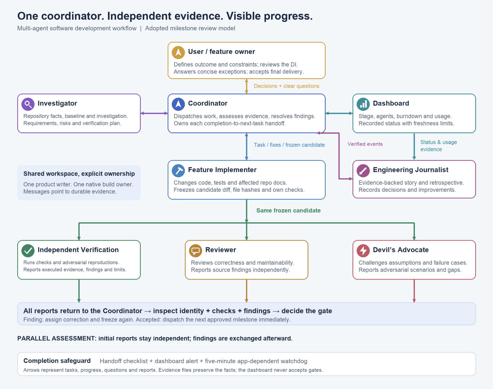

# Make progress visible. Make acceptance evidence-based.

## One accountable coordinator, a team of independent specialists

Move a feature from a clear brief to an approved design, identified candidates, independent assessment, accurate documentation and a reviewable delivery. Keep the user informed without making them manage agent handoffs.

[Start a feature](quick-start.md){ .md-button } [Get the prompt](templates.md){ .md-button } [Download the workflow PDF](assets/coordinated-multi-agent-workflow.pdf){ .md-button }

This guide packages a working practice refined during a software feature implementation. It includes the changes prompted by actual friction: completed agents left without a next assignment, unclear task counts, weak interaction predicates and a burndown clock that kept advancing after completion.

## Team and communication

[Explore the roles and handoff paths](roles.md), or [open the diagram at full size](assets/agent-communication.png). The coordinator owns the acceptance decision; Verification, Reviewer and Devil’s Advocate assess the same frozen candidate in parallel.

## What you get

| Artifact | Use it for |
| --- | --- |
| Kickoff prompt | Define scope, authority, roles, approval gates and delivery |
| DI template | Present observed behavior, choices, ordered stages and acceptance evidence |
| Assignment and gate templates | Name one owner, exact candidate, shared resources, independent reports and acknowledged next action |
| Example state and checker | Demonstrate a bounded, machine-checkable handoff record |
| Live dashboard and workflow state | Serve a reusable display with current stage, next action, all pending approvals and responsive burndown |
| Five-minute watchdog | Audit completions and dispatch authorized handoffs quietly between active turns |
| Confluence outputs | Review the published DI before implementation; capture lessons as its child page |
| Retrospective template | Collect actual independent reflections, real exchanges and a checked record |

## The central rule

**An agent finishing an assignment creates a coordinator obligation.** Read its report, check the source identity and executed evidence, record the gate disposition, release resources and dispatch the next authorized owner. Record that the assignment was acknowledged or expose a precise dependency.

Agent activity is not feature progress. Test count is not requirement coverage. An accepted local candidate is not an installed or released product.

The [lessons](lessons.md) explain what the completed implementation and retrospective added. Templates use configurable roles and native project commands rather than project-specific defaults. [Publication boundaries](reference.md) describe the explicitly approved PDF reference and how other company-source material stays outside the kit.

!!! note "A workflow kit, not a service"
    These files do not launch agents, monitor a session or enforce the truth of reports by themselves. The coordinator and available runtime tools carry out the contracts.
