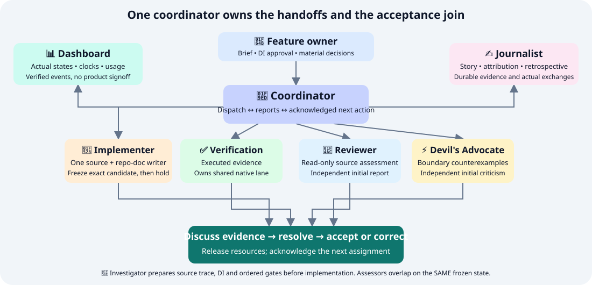

# Roles and communication

The coordinator assigns bounded work and receives progress, questions and completion evidence. Specialists may exchange findings after their independent initial reports are preserved. Dashboard and Journalist consume verified events and durable evidence; arrows do not grant source mutation authority.

| Role | Owns | Boundary |
| --- | --- | --- |
| 🧭 Coordinator | Scope, actual status consumption, gate disposition, resource ownership and next assignment | Accountable for feature continuity; does not infer completion from idle agents |
| 🔎 Investigator | Source trace, baseline, design alternatives, DI and stage order | No speculative implementation before approval |
| 🔨 Implementer | Product source, tests, examples and affected repo documentation | One writer; stops mutations while its candidate is frozen |
| ✅ Verification | Independent executed checks, selection proof, logs and coverage limits | Exclusive owner of shared native outputs/caches during its lane |
| 💬 Reviewer | Correctness, integration and maintainability | Read-only against the frozen identity; initial conclusions independent |
| ⚡ Devil's Advocate | Failure boundaries, hidden assumptions and concrete counterexamples | Concerns need a trigger and a resolving observable |
| 📊 Dashboard | Dashboard UI, current states, clocks and scoped usage | Never accepts a product gate |
| ✍️ Journalist | Factual story, decision history, attribution and retrospective record | Does not replace Implementer product docs or invent dialogue |

## The coordinator's completion loop

1. Inspect actual runtime agent status and new reports.
2. Read every completed assignment's output; verify the exact candidate.
3. Check executed commands, selection, findings and remaining obligations.
4. Preserve initial reports, then arrange required cross-role exchanges.
5. Resolve findings or dispatch a bounded correction.
6. Record acceptance/hold, release native resources and dispatch the next owner.
7. Record the receiving owner's acknowledgment and update the dashboard.

Use a current-state record plus timestamped history. Do not repeat old pending language after acceptance.

## When the user is needed

| Touchpoint | Required input |
| --- | --- |
| Feature definition | Desired behavior, constraints and destination |
| DI approval | Concrete design choices, ordered stages and delivery boundary |
| Conditional exception | Material scope/semantics change, unavailable required check or missing authority |
| Final review | Inspect delivered behavior and remaining limits |
| External action | Commit, push, install or publication only if not already authorized |

Ask one concise question with a recommendation and consequence. Routine fixes, internal handoffs and checks within the approved plan continue autonomously.

## Parallel verification lanes

Additional verifiers help when checks use independent resources: documentation semantics, read-only evidence review, isolated platform workers or proven separate build directories. A lane must name its candidate, checks, resource ownership and join condition.

Splitting workers around the same shared cache or service does not create safe parallelism. Keep a single native execution owner unless isolation is demonstrated; expose the bottleneck instead of duplicating builds.
